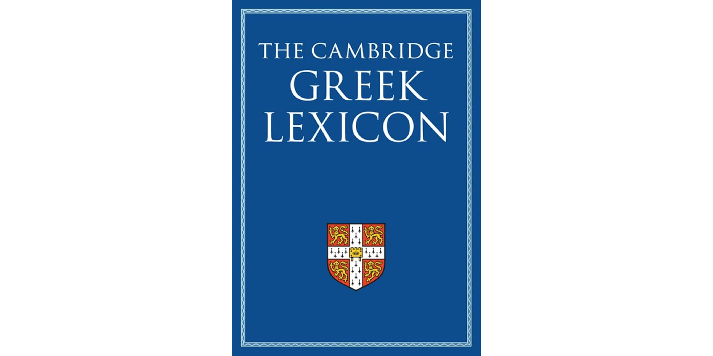
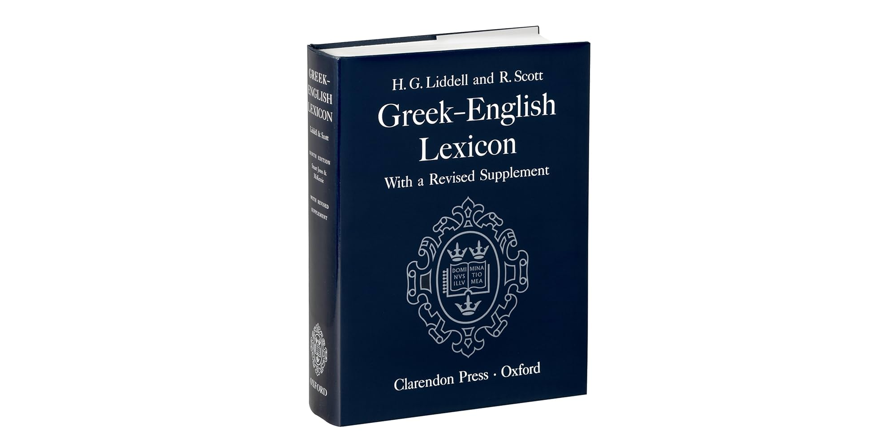
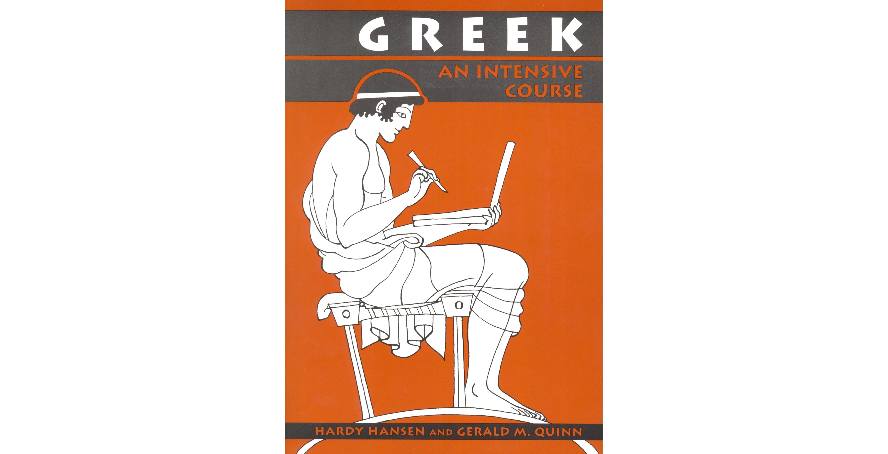
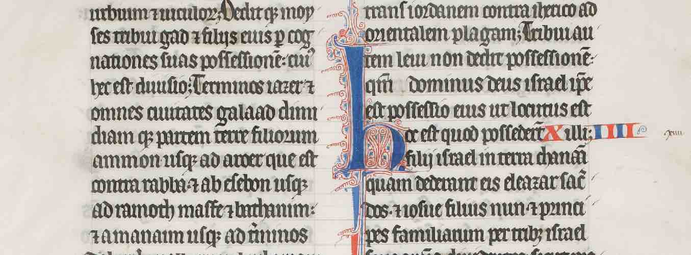

The discovery of a new Roman villa or the deciphering of an ancient scroll still captivates our imagination. But why do
some people feel such a strong pull toward things from the past, like ancient languages? It's a question that goes
beyond simple curiosity, touching on some of the deepest aspects of what it means to be human.

Ultimately, our fascination with the past is driven by two powerful forces: the
[__practical__](#the-practical-developing-critical-thinking) and
[__psychological__](#the-psychological-nostalgia-and-a-longing-for-the-past).

The Practical: Developing Critical Thinking
-------------------------------------------

Studying ancient languages and literatures requires rigorous analysis, critical evaluation of sources, and the ability
to synthesize fragmented evidence. It's a mental workout that builds skills in research, __problem-solving__, and
__logical reasoning__, which are applicable to many different fields.

To understand how reading ancient Greek or Latin texts develops critical thinking, for example, consider a passage from
a historical account, such as a work by the Roman historian Tacitus. Imagine we are a student reading a section of
Tacitus' _Annals_, which details the reign of Emperor Tiberius. We come across a passage where Tacitus describes a
particular senator, Sejanus, as being power-hungry, manipulative, and a major threat to the emperor. Tacitus presents
this view with strong, often loaded, language.

By __questioning the source__, we first recognize that Tacitus is not a neutral observer. He was writing decades after
the events he describes, during a time when his political sympathies were decidedly anti-imperial. Critical thinking
prompts us to ask:

- What was Tacitus's purpose in writing this? Was he trying to present an objective history, or was he using the past to
  critique the present? 
- What were his sources of information? Did he have access to firsthand accounts, or was he relying on rumors and later
  historical works?
- How might his personal biases have influenced his portrayal of Sejanus?

Latin and Greek are highly structured and rich in rhetorical devices. Analyzing how Tacitus presents his information is
also, quite on the contrary, part of practicing the critical thinking. For instance:

- Is he using direct statements, or is he employing irony and insinuation?
- What specific words does he choose to describe Sejanus? Are they neutral adjectives, or are they emotionally charged?
  For example, does he use a word like "ambitious" or a more damning term like "treacherous"?
- What is the grammatical structure of the sentence? Is the emphasis placed on Sejanus's actions or on his motivations?

In the Tacitus example, __analyzing the language and rhetoric__ is not just about appreciating his writing style; it's
the very core of critical thinking because it helps us understand the situation _subjectively_. This might seem
counterintuitive - we think of critical thinking as leading to objectivity - __but in the context of ancient history,
understanding the author's subjectivity is the only path to a more objective understanding of the event itself__.

When Tacitus writes, he isn't a modern journalist striving for neutrality. He is a Roman aristocrat writing with a
specific worldview.
[By analyzing his language, we can __identify his intent and bias__](https://dcc.dickinson.edu/tacitus-annals/introduction/tacitus-style#footnote-018-backlink).
There are at least 2 approaches for doing this:

1. _Loaded Words_: Tacitus uses the Latin word _perfidus_ to describe Sejanus. While a dictionary might translate it
   simply as "treacherous," the word carries a heavy moral weight. It's not just a description of an action but a moral
   condemnation. A critical reader notes this word choice and thinks: "Tacitus isn't just reporting that Sejanus
   betrayed someone; he is explicitly telling me that Sejanus is a bad person." This reveals Tacitus's perspective and
   his desire to shape the reader's opinion.
2. [_Rhetorical Devices_](https://hestia-blog.squarespace.com/blog/tacitus-rhetoric-and-reporting-power#:~:text=As%20such%2C%20Tacitus%20conceals%20his,larger%20structural%20and%20thematic%20features.): can make writer's point without explicitly stating it. Tacitus might use _insinuation_ or
   _juxtaposition_. For example, he might describe Sejanus's rise to power and then, in the very next sentence,
  mention a sudden, unexplained illness of Tiberius's son. He never directly accuses Sejanus of poisoning the son, but
  by placing the two facts together, he guides the reader to a suspicious conclusion. A critical reader recognizes this
  rhetorical move and understands that Tacitus is crafting a narrative, not just presenting a timeline of events.

In addition, analyzing the language helps us __draw the line between "fact" and "interpretation"__ which has become
blurry. For example, Tacitus might state, "Sejanus was the commander of
the Praetorian Guard." This is a factual statement that can be corroborated. However, when he writes, "Sejanus, swollen
with arrogant ambition, began to dominate the emperor," he is offering an interpretation of Sejanus's motivations. By
paying close attention to the adjectives (_arrogant_) and adverbs (_dominate_), a critical reader can separate the
verifiable fact from the author's subjective judgment. We learn not what _happened_, but what _Tacitus thought about_
what happened.

Tacitus often uses language designed to evoke emotion - outrage, fear, or contempt. By studying his syntax and word
choice, we can see how he is trying to manipulate his readers' feelings. A critical reader asks: "Why is he trying to
make me feel this way? What is his ultimate goal in arousing this emotion?" We are essentially __reverse-engineering the
text's persuasive effect__.

:::tip

Analyzing Tacitus's language and rhetoric doesn't make us more objective in a simple, straightforward way. Instead, it
makes us __critically aware of the author's subjectivity__. We learn to see Tacitus as a product of his time and his
class, with his own agendas and biases. By understanding his subjective perspective, we can then more accurately weigh
his testimony against other sources (Suetonius, Cassius Dio, archaeological evidence) and piece together a more nuanced
and "objective" picture of what actually occurred in Tiberius's court. We don't just read history; we learn to read the
historian.

:::

A critical reader doesn't stop with Tacitus. They would then __look for other sources to compare and contrast__. They
would read the works of other ancient historians who wrote about the same period, such as Suetonius or Cassius Dio to
see if their accounts of Sejanus match Tacitus's and where do they differ. They also might consider the political
climate to verify whether Sejanus is truly a threat to the emperor, or was he a scapegoat for Tiberius's own unpopular
policies

By engaging in this process, we move beyond simply translating the words on the page. we are actively evaluating the
information, questioning the author's intent, and building a more nuanced and accurate picture of historical events.
This process of critical analysis is the core of historical scholarship and is a fundamental skill developed by studying
ancient texts.

### Differing from Contemporary Materials

But the process above can also be achieved through contemporary news reading. After all, critical thinking is vital for
reading contemporary news, and the skills we use - like questioning the source, identifying bias, and looking for
corroborating evidence - are fundamentally the same. What makes ancient texts special then?

What's special in this context is the sheer intensity of the critical thinking required, due to a unique set of
challenges and limitations. These challenges that make ancient texts a powerful and distinctive training ground for
critical thinking are:

- __The Time and Culture Gap__: When we read contemporary news, we share a common cultural context with the writer and
  the events being reported. We understand the political system, the social norms, and the language nuances. With an
  ancient text, we are a complete outsider. This forces us to think about:

  - _Unknown Biases_: What were the author's social class, political allegiances, and religious beliefs? We often have
    to infer these from limited information.
  - _Unfamiliar Values_: Ancient societies had completely different ethical frameworks. A "hero" in ancient Greek
    literature might be a ruthless tyrant by today's standards. We have to analyze the text on its own terms before we
    can evaluate it from a modern perspective.
  - _Lost Context_: We are missing so much information. We don't have the "live broadcasts" or "interviews" that a
    modern journalist has. The text is often a fragment of a larger work, and many other sources from that time period
    are lost forever.

- __The Problem of Physical Survival__: A modern news article is easily verified or debunked by a vast network of other
  sources, photos, and digital archives. An ancient text exists as a physical object - a manuscript - that has been
  copied by hand over centuries, often with errors, deliberate changes, and missing parts. This adds a whole new layer
  of critical thinking:

  - _Textual Criticism_: We have to analyze the different surviving manuscripts to reconstruct what the original author
    might have written. Was this word or phrase a scribe's mistake? Was this entire section added later? This is a form
    of forensic analysis that is rarely needed for a modern text.
  - _Translation Challenges_: The meaning of an ancient word can be contested. A single Latin word might have a dozen
    possible translations, and we choice can completely change the interpretation of a passage. This forces us to weigh
    evidence and argue for our chosen meaning.

- __The Absence of a "Truth" to Check Against__: When a modern news source makes a claim, we can often check it against
  other news outlets, official statements, or data. With ancient history, there is often no definitive "truth." The
  ancient sources are the evidence. The "truth" is what we can construct from a careful, critical, and humble evaluation
  of those sources. Our critical thinking is not just about identifying errors; it's about building an entire historical
  narrative from the ground up, based on a handful of fragmentary documents.

### Developing Critical Thinking Skills

Developing critical thinking skills gradually with ancient texts is a process that builds upon itself, moving from a
foundation of language mechanics to higher-level historical and literary analysis in phases. The idea is to
systematically train our mind to move from literal translation and grammar-based logic to nuanced, multi-layered
critical analysis. This process not only makes us a more careful reader of ancient texts but also a more rigorous and
skeptical reader of all information.

#### Phase 1: Learning Language (Months 1-12)

This phase is all about learning the tools of the trade. We can't critically analyze a text if we can't read it. It's
the foundation. Start with the basics. Don't worry about complex philosophy just yet. Focus on learning the language
itself. Master the grammar and vocabulary of a language like Latin or Ancient Greek. This initial step is a critical
thinking exercise in itself, as we are learning to solve a logical puzzle with every sentence we translate.

The ideal amount of time we spend each day during the "Foundations" period should be based on __consistency__ and
__focused effort__ - a moderate, daily commitment is far more effective than sporadic, long study sessions. A realistic
and sustainable goal for the first 1-12 months would be to aim for __30 to 90 minutes per day, six to seven days a
week__, depending on _how busy_ we are on a particular day:

- __30 Minutes: The Absolute Minimum.__ This is the time we should aim for even on our busiest days. It's enough to
  review vocabulary flashcards, go over a grammar point from our textbook, or translate a short sentence or two. The
  goal here is to maintain daily exposure to the language and prevent ourselves from losing momentum. Consistency is
  the most important factor in language learning, and a short daily session is the key to maintaining it.
- __60 Minutes: The Ideal Sweet Spot.__ An hour a day allows for a more comprehensive session. We can dedicate a portion
  of this time to learning _new_ material (a new chapter or a set of new vocabulary words) and another portion to
  _reviewing_ old material. This time frame allows us to move at a good pace without feeling overwhelmed. __It's often
  the minimum amount of time recommended by many serious self-learners and can be broken up into smaller chunks
  throughout the day if a full hour isn't possible all at once__.
- __90 Minutes: The Accelerated Approach.__ If you have more time and want to make faster progress, 90 minutes is an
  excellent target. With this amount of time, we can tackle more challenging exercises, review material more thoroughly,
  and start to build more complex sentences. It allows us to both learn and apply the new information in a single
  session.

In addition, instead of thinking, "I need to study for 60 minutes," think about what we will accomplish during that
time. Our study session should be an active process, not a passive one. A good daily plan could look like this:

- 5-10 minutes: Review old vocabulary with flashcards.
- 20-30 minutes: Work through new grammar and examples in our textbook.
- 20-30 minutes: Translate a short passage from the textbook or an easy reader.
- 5-10 minutes: Recite vocabulary out loud or review the text we just translated.

:::tip

Most people with jobs are most free after dinner. There are 2 periods at night

1. After dinner
2. Before sleeping

From a cognitive and neurological perspective, studying just before we go to sleep at night is generally considered the
more effective of the two options for memorization. The primary reason for this is a process called
__memory consolidation__. When we sleep, our brain is not inactive; it is working to process, organize, and consolidate
the information we learned while you were awake. This process moves new memories from a short-term, fragile state to a
more stable, long-term state. Studying right before sleep allows this consolidation process to begin with the most
recently learned information fresh in your mind, which can significantly improve recall.

While studying after dinner might also be effective, it often comes with a few potential drawbacks. The period after a
meal can sometimes be associated with a "post-lunch dip" or a feeling of drowsiness, especially if the meal was large.
Additionally, if there are hours of wakefulness between studying and sleeping, other activities, information, or
distractions can interfere with the memory consolidation process.

__The period directly before sleep has a significant scientific advantage due to the powerful role of sleep in cementing
new information into long-term memory__

:::

By focusing on daily, consistent, and active engagement, we will build a strong foundation of grammar and vocabulary.
This approach not only makes the process more manageable but also ensures that when we are ready to move to
[Phase 2](#phase-2-the-transition-months-12-24).

The list below are my personal picks for materials used to study Ancient Greek, Latin, and other
antiquity languages:

- Ancient Greek

  - Dictionaries

    |  [The Cambridge Greek Lexicon](https://dokumen.pub/the-cambridge-greek-lexicon-9781108836999-9780521826808-9781139050043-9781108836982.html)  |  [The Oxford Greek-English Lexicon](https://archive.org/details/greekenglishlexi0000lidd_u9m8/mode/2up)  |
    |:---------------------------------------------------------------------------------------------------------------------------------------------:|:--------------------------------------------------------------------------------------------------------:|
    |                                                                                                           |                                                                         |

  - [Greek: An Intensive Course, 2nd Revised Edition] (https://pdfcoffee.com/4-hansen-hardy-quinn-gerald-m-greek-an-intensive-course-5-pdf-free.html)

    

    - [Partial answer keys](https://leitourgeia.com/greek-resources/)
    - [Translations for the exercise sentences](https://atticgreek.wordpress.com/tag/hansen-and-quinn-intensive-greek/)
    - [Pronunciation Drills in Intro chapter](https://youtu.be/mAAuMhQkaPA?si=h_xx5_waUVddpetP)

  - [Learn Ancient Greek - Ancient Greek (LSJ)](https://lsj.gr/wiki/LSJ:Learn_Greek)

    - [The first year of Greek](https://archive.org/details/firstyearofgreek00alle)
    - [Greek Grammar, William W. Goodwin](https://archive.org/details/greekgrammar00gooduoft/mode/2up)

  - [Learning resources on Reddit](https://www.reddit.com/r/AncientGreek/wiki/resources/)

- Latin

  - [Latin: An Intensive Course](https://archive.org/details/LatinAnIntensiveCourse/mode/2up)

- Old Persian

  - [Achaemenid Royal Inscriptions](https://www.livius.org/sources/content/achaemenid-royal-inscriptions/)
  - Fonts

    - [Omniglot](https://www.omniglot.com/links/fonts.htm#opc)
    - [Old Persian Cuneiform](https://www.wazu.jp/gallery/Fonts_OldPersianC.html)
    - [FontSpace](https://www.fontspace.com/category/old-persian)

##### Static Text Analysis

At this stage, our critical thinking is focused on a micro-level:

- __Identify the Parts__: Our task is to accurately identify nouns, verbs, adjectives, and their relationships. This is
  a puzzle-solving exercise. We aew asking: "This noun is in the accusative case; that means it's the direct object of
  this verb. But what if it's the subject of this infinitive clause?" This constant process of parsing and logical
  deduction is a direct exercise in critical thinking.
- __Understand Grammar as Meaning__: We learn that a specific grammatical choice (e.g., the use of the subjunctive mood)
  isn't random; it conveys a particular meaning, such as uncertainty or a hypothetical condition. We are learning to
  read the author's intentions through their grammatical choices.

#### Phase 2: The Transition (Months 12-24)

Once we have a firm grasp of grammar, we can start to apply our skills to more complex texts and begin to engage with
the critical analysis aspect.

Transition from textbook's simplified passages to real authors, like Caesar, Cicero, or Xenophon. These texts will be
more complex and will present ambiguities.

:::tip[Use a Commentary]

A good commentary is our best friend. It won't give us the answer, but it will provide context, point out potential
ambiguities, and highlight scholarly debates. This is where we learn to "listen" to the critical conversation.

:::

Begin to read for rhetoric by paying attention to the author's style. For example, Caesar's _Gallic Wars_, he uses the
third person ("Caesar led his men...") to create a sense of objectivity and authority, even when writing about his own
actions. We are learning to identify a persuasive technique.

#### Phase 3: The Deep Dive (Year 3 Onwards)

This is where we fully develop our critical thinking skills by moving beyond individual texts to a broader historical
and philosophical context what include:

- __secondary sources__: Beyond the ancient authors, we will also read what modern scholars say about them. This exposes
  us to different interpretations, methodologies, and scholarly debates. We might find two historians who have
  completely opposite views on an event described by Livy, and our job is to evaluate their arguments and the evidence
  they use.
- __different genres collectively compared__: Read a historical text (e.g., Thucydides' _History_) alongside a
  philosophical one (e.g., Plato's _Republic_) and a play (e.g., a tragedy by _Sophocles_) from the same time period.

  - How does the portrayal of "justice" differ between these 3 genres?
  - How do the authors use their respective forms to convey their ideas?

  This is where we develop the ability to think interdisciplinarily and to synthesize information from a variety of
  sources, which is a hallmark of sophisticated critical thinking.

The Psychological: Nostalgia and a Longing for the Past
-------------------------------------------------------

> Image source: [Latin Paleography](https://hmmlschool.org/latin-gothic/)

While some people may have a romanticized view of the past, there is a deep human connection to history that can be
comforting. Thinking about the past can provide a sense of continuity and resilience, reminding us of challenges that
have been overcome and providing a sense of hope for the future. We now discuss the deep-seated mechanisms of human
psychology. While the [previous discussion](#the-practical-developing-critical-thinking) focused on the "what" and
"how" of studying ancient texts, we question now gets to the "why" on a personal, emotional level.

It is a well-established concept in Psychology that a person's obsess to the past is tied to their past experiences,
both personal and cultural. Here we frame it in a particularly compelling way through the lens of ancient languages. But
before we get into that, we first need to learn some Psychologies

### The Psychology of Nostalgia: A Coping Mechanism

Psychologists now understand nostalgia not as a disease (as it was once thought), but as a powerful and generally
positive emotional tool.[^1] It's often triggered by feelings of loneliness, uncertainty, or stress.[^2] When we feel
disconnected or overwhelmed in the present, our minds can instinctively reach back into memory for comfort.[^3]

(To be continued...)

[^1]: https://www.miragenews.com/why-we-long-for-the-past-the-science-behind-1013752/#:~:text=Contrary%20to%20previous%20beliefs%20that,stress%2C%20loneliness%2C%20or%20transition.
[^2]: https://mentalzon.com/en/post/2046/nostalgia-the-surprising-psychology-behind-our-longing-for-the-past#:~:text=Nostalgia%20tends%20to%20loom%20large,isolation%2C%20or%20feelings%20of%20loneliness.
[^3]: https://www.psychologytoday.com/us/basics/nostalgia#:~:text=Helps%20Shape%20Us-,The%20Emotional%20Comfort%20of%20Nostalgia,can%20give%20us%20emotional%20comfort.