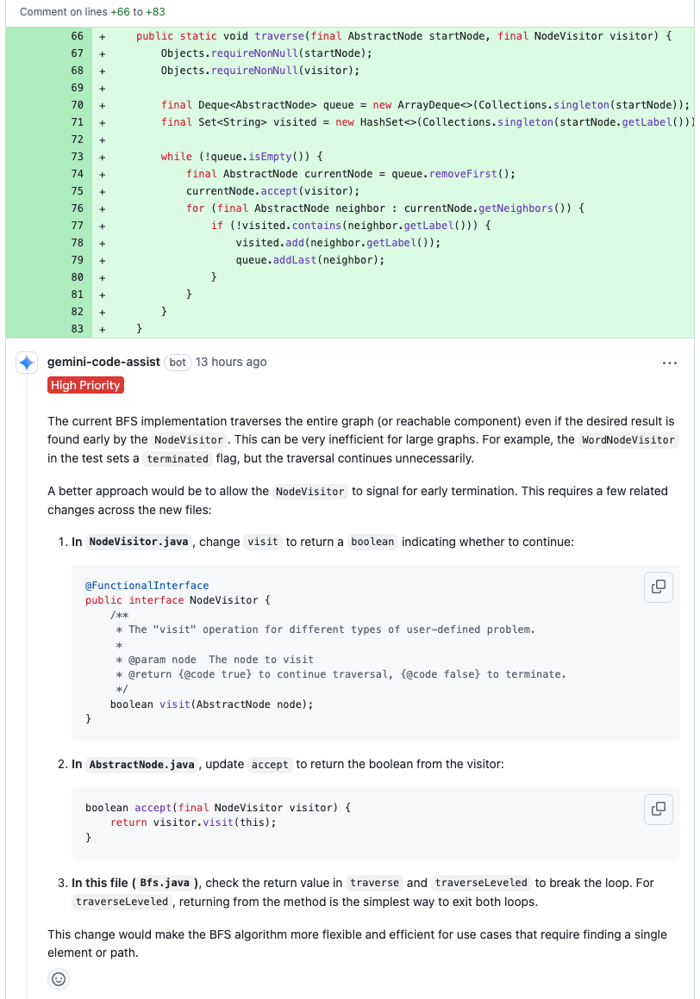

How the Lesson Started, By Accident
-----------------------------------

It was a regular AI review session in
[a pull request](https://github.com/QubitPi/gearbox/pull/23#discussion_r2260539188) on one of my projects. Little
background - I was implementing a general BFS (Breadth-First Search) algorithm which can be whipped as a JAR library
into one of my developing Java webservices to solve various business problems. To boost its generality, I decided to
implement it using the [Visitor pattern](https://refactoring.guru/design-patterns/visitor), which by design is able to
separate the fixed algorithm and variable business logic and, therefore, make the algorithm applicable to general use
cases. The code below shows the _simplified_ version of my first draft sent to
[gemini-code-assist](https://developers.google.com/gemini-code-assist/docs/review-github-code) for review:

:::tip

- The irrelevant codes, such as Javadoc, `import`s, null-checks, etc., have been removed to highlight the essentials
- The complete conversation between AI and me can be found in the
  [original pull request](https://github.com/QubitPi/gearbox/pull/23)

:::

```java title="NodeVisitor" "void"
public interface NodeVisitor {

    void visit(AbstractNode node);
}
```

```java title="AbstractNode" "void"
public abstract class AbstractNode {

    void accept(final NodeVisitor visitor) {
        visitor.visit(this);
    }
}
```

```java title="General BFS implementation" {"AI Review: ⚠️ No early return for large graph dataset":4-13}
public static void traverse(final AbstractNode startNode, final NodeVisitor visitor) {
    final Deque<AbstractNode> queue = new ArrayDeque<>(Collections.singleton(startNode));
    final Set<String> visited = new HashSet<>(Collections.singleton(startNode.getLabel()));

    while (!queue.isEmpty()) {
        final AbstractNode currentNode = queue.removeFirst();
        currentNode.accept(visitor);
        for (final AbstractNode neighbor : currentNode.getNeighbors()) {
            if (!visited.contains(neighbor.getLabel())) {
                visited.add(neighbor.getLabel());
                queue.addLast(neighbor);
            }
        }
    }
}
```

Having analyzed the code above, the Gemini AI review found a performance issue and argued that if `traverse` method is
applied to a large dataset, the `while` loop above could take a lot of time. So the AI figured out a way for
the early termination of the loop with the following review comments:



Basically, the AI is asking me to __break the strict Visitor pattern for a performance gain__ by changing the return
type of `NodeVisitor.visit(AbstractNode node)` from `void` to `boolean`. This almost immediately triggered my opposition
and I left my response as follows:


My response focused on telling AI returning `boolean` in this case was __not a standard__ Visitor practice. The AI,
however, is resisting with the following followup:


Man what a thoughtful challenge... What's interesting though is I started to feel a common tension in software design:
balancing __strict adherence to a pattern's principles__ with __real-world performance needs__. I keep defending the
`void` return in `visit`


The story went on...The [original pull request](https://github.com/QubitPi/gearbox/pull/23) had all the followup
details and it's enough for us to transcendentalize the topic:

- The AI really masters communicating _professionally_ in the tech debate, and more importantly
- I started to ask: __what are the two conflicting philosophical or psychological ideologies behind this BFS design
  debate between human and machine?__

Turning Point - From "Code Review Debates" to "Ideologies Conflicts"
--------------------------------------------------------------------

The debate over the `void` versus `boolean` return type for a `visit` method in a BFS Visitor pattern implementation,
particularly concerning early termination, actually stems from two conflicting philosophical or psychological ideologies
in software design: __Purism (or Idealism) vs. Pragmatism__

__Idealism__ champions strict adherence to design patterns and principles (like the _Single Responsibility Principle_
and _Command-Query Separation_). From a purist perspective, the _Visitor_'s sole responsibility is to perform an
operation on the visited element, not to dictate the flow of the traversal. Returning a _boolean_ for control flow
introduces a coupling that compromises the pattern's intended separation of concerns. The traversal algorithm (_BFS_)
should be generic and complete its traversal of reachable nodes, while the _Visitor_ focuses purely on the
element-specific action. This approach values the elegance, maintainability, and long-term extensibility that comes from
clear, decoupled responsibilities.

Idealism favors the perspective of _Generality_, which emphasizes creating reusable, broadly applicable algorithms. The
[`traverse`](#how-the-lesson-started-by-accident) method designed for generality aims to visit all reachable nodes,
regardless of the visitor's internal goal. It's a foundational traversal primitive. Making it stop early based on a
visitor's signal would specialize it into a "search-and-terminate" algorithm, potentially limiting its utility for other
scenarios that genuinely require a full traversal (e.g., calculating graph properties, building a complete map of
connections). This aligns with the idea of building robust, foundational components.

__Pragmatism__, on the other hand, prioritizes practical outcomes and efficiency over strict theoretical purity. A
pragmatic designer would argue that if a slight deviation from a pattern's rigid definition (like returning a `boolean`
from `visit`) leads to significant performance improvements (e.g., avoiding unnecessary computation on large graphs),
it's a worthwhile trade-off. The goal is to build effective software that meets real-world demands, and sometimes that
means adapting patterns to fit specific performance requirements. This approach values utility, performance, and solving
immediate problems efficiently.

Pragmatism possesses the viewpoint of _specific optimization_ that focuses on optimizing for a particular use case, such
as finding a target node as quickly as possible. For this specific scenario, continuing the traversal after the target
is found is clearly inefficient. The argument is that if a common and critical use case (like searching) can be made
significantly faster by a minor adjustment to the API, that optimization should be considered. This prioritizes the
performance of a frequently executed operation over the absolute theoretical purity of the general traversal.

The Two Conflicting Personalities behind the Two Software Design
----------------------------------------------------------------

Different personality types can drive these software design debates as well. In the [context of the BFS visitor pattern
discussion](#how-the-lesson-started-by-accident), two conflicting personalities often emerge: the __Architect__ and the
__Hacker__.

:::caution

"Architect" in this section is NOT to be confused with the "Architect" within the Myers-Briggs Type Indicator (MBTI)
framework. The use of "Architect" and "Hacker" was intended to describe archetypes or roles in software development,
representing distinct philosophical approaches to design, rather than strictly adhering to formal psychological
personality typing systems like the 16-Personality scheme. The fact that MBTI also has an "Architect" (INTJ) type, which
often describes individuals with strong logical, strategic, and planning tendencies, is a __coincidence of terminology__

:::

### The Architect 🏛️

The Architect embodies the __Purism/Idealism__ and _Generality_ ideologies. This personality is deeply concerned with
the long-term health, scalability, and maintainability of the codebase.

For the Architect, the Visitor pattern's strength lies in its clear _separation of concerns_. The `visit` method should
only perform an operation on the element, not control the traversal. Deviating from this feels like a compromise of
the pattern's integrity. Architects practices __strict adherence to patterns__. They design the BFS algorithm to be a
truly __general-purpose__ traversal mechanism, capable of being used for any scenario where we need to visit every
reachable node. Optimizing for a single "search" use case by baking termination logic into the `visit` method feels like
specializing a general tool.

Performance optimizations are important, but not at the expense of muddying the design, making it harder to understand,
or limiting future extensibility. Architects argue that for most graphs, the overhead of continuing a few extra
iterations after a target is found is negligible, and for truly massive graphs, a __long-term view__ of more fundamental
architectural changes might be needed anyway. They prioritize __correctness over convenience__

:::tip[Core motivations of Architect]

- elegance
- correctness
- consistency, and
- future-proofing

Architects believe in
[doing things "the right way"](https://ai.qubitpi.org/posts/software-is-about-making-it-right/) according to established
patterns and principles.

:::

### The Hacker 💻

The Hacker (in the positive sense of a clever problem-solver, not a malicious one) embodies the __Pragmatism__ and
_specific optimization_ ideologies. They are driven by getting things done efficiently and solving immediate,
high-impact problems

While they appreciate patterns, they honor __"Get it done" mentality__ and are willing to bend or adapt them if it leads
to a clear and measurable performance gain, especially for common use cases. If a search operation is a critical
bottleneck for large graphs, they put __performance first__ and see the continued traversal after finding the target as
a waste of resources. A `boolean` return that allows the traversal to immediately stop is a direct and effective
solution to this problem. Hackers are more focused on the __short-term impact__ of the immediate, measurable benefits of
an optimization. The "slight deviation" from pattern purity is a small price to pay for a "significant performance
improvement." They prioritize __convenience over correctness__

:::tip[Core motivations of Hacker]

- speed
- efficiency
- tangible results, and
- practical solutions

Hackers are focused on making the current system perform optimally.

:::

What Different Past Personal Experiences Could Lead to Such a Diverted World-View like Architect v.s. Hacker?
-------------------------------------------------------------------------------------------------------------

### Technical

Different past personal experiences often shape the divergent worldviews of the "Architect" and "Hacker" in software
design. These experiences cultivate distinct priorities, risk tolerances, and problem-solving approaches.

:::important

Most people possess traits from both, and their experiences can lead to a more balanced approach over time.

:::

#### The Architect's Formative Experiences 🏛️

The "Architect" mindset is typically forged in environments where __stability__, __scalability__, __long-term
maintainability__, and risk mitigation are paramount.

- __Working on Large, Complex, and Long-Lived Systems__: Think enterprise software, financial systems, aerospace, or
  critical infrastructure. In these domains, a single bug can have catastrophic consequences (financial loss, safety
  hazards). Architects learn the hard way that quick fixes often lead to compounding
  [technical debt](https://neontri.com/blog/enterprise-software-development/#technical-debt) and instability over
  years.
- __Experiencing the Pain of Technical Debt__: They've likely inherited or worked on systems that were initially
  "hacked" together for speed. They've spent countless hours debugging, refactoring, and trying to extend brittle
  codebases, leading to a deep appreciation for upfront design and robust architecture.
- __Involvement in System Outages or Critical Bugs__: Being on call for major incidents caused by poor design, lack of
  testing, or insufficient planning teaches them the severe consequences of prioritizing speed over stability.
- __Formal Education and Mentorship__: Often, Architects have a strong academic background in computer science,
  emphasizing theoretical correctness, algorithms, data structures, and software engineering principles. They may also
  have been mentored by senior engineers who instilled a disciplined approach to design.
- __Working in Regulated Industries__: Industries with strict compliance requirements (e.g., healthcare, finance,
  government) necessitate meticulous design, extensive documentation, and rigorous testing, reinforcing a methodical and
  risk-averse approach.

These experiences instill a deep-seated value for __structure__, __predictability__, and __preventing future problems__,
even if it means a slower initial pace. They see the entire lifecycle of software and understand the compounding cost of
shortcuts.

#### The Hacker's Formative Experiences 💻

The "Hacker" mindset, in its positive sense, often develops in environments that prioritize __speed__, __rapid
iteration__, __immediate impact__, and __direct problem-solving__.

- __Startup or Fast-Paced Environments__: In startups, the primary goal is often to find product-market fit quickly,
  ship features rapidly, and iterate based on user feedback. Survival depends on speed, and "perfect" architecture can
  be seen as a luxury that delays crucial market entry.
- __Being a "Hero" Problem Solver__: They might have gained recognition for quickly fixing urgent production issues,
  implementing features under tight deadlines, or building prototypes that demonstrate immediate value. This reinforces
  the idea that direct action and quick results are highly valued.
- __Self-Taught or Project-Based Learning__: Many "Hackers" are highly skilled self-starters who learned by doing,
  experimenting, and building. Their knowledge is often gained through practical application and overcoming immediate
  technical hurdles, rather than through abstract theoretical study.
- __Projects with Short Lifespans or Disposable Prototypes__: If a project is meant to be a proof-of-concept or has a
  limited expected lifespan, the long-term architectural concerns become less relevant than getting it working quickly.
- __Focus on Direct Performance Gains__: They are often acutely aware of performance bottlenecks and driven to optimize
  code directly for speed, seeing any "unnecessary" abstraction or indirection as a barrier to efficiency.

These experiences cultivate a strong bias towards __action__, __efficiency__, and __delivering tangible results now__.
They are less concerned with hypothetical future problems and more focused on solving the current challenge in the most
direct way possible.

### Psychological

Certain early life experiences and inherent temperaments can also predispose individuals to lean towards an "Architect"
or "Hacker" worldview.

:::important

Early experiences often lay the groundwork for how individuals approach challenges, deal with uncertainty, and
prioritize different aspects of a solution. It is, therefore, important to remember that these are tendencies, not
deterministic paths. Many individuals develop a blend of these traits, and [professional experience](#technical) will
reinforce or modify these predispositions.

:::

#### For the "Architect" Mindset 🏛️

The Architect's preference for structure, planning, and long-term stability often stems from experiences that emphasize
__order__, __consequences__, and __thoroughness__.

There are positive forces that drives one into this direction. Children raised in environments with clear, consistently
enforced rules and predictable consequences may develop a strong internal sense of order and a belief in the importance
of adherence to established guidelines. They learn that following rules prevents negative outcomes and leads to
stability. If parents or caregivers encouraged planning, thinking ahead, and considering the long-term implications of
actions (e.g., "What happens if we don't save money now?"), this can foster a systematic, preventative mindset. Growing
up in a household where tasks were expected to be completed meticulously, with attention to detail and a focus on
durability (e.g., "Do it right the first time, so you don't have to do it again"), can instill a deep appreciation for
robust solutions.

Negative forces can come into play as well. This could be anything from a chaotic household where things frequently went
wrong due to lack of planning, to observing poorly organized projects in school or community activities. Experiencing
the negative consequences of disorder can create a strong desire to build robust, resilient systems. If they frequently
encountered systems or processes that were unreliable, broke easily, or were difficult to understand, it could foster a
drive to design for stability and clarity.

From a personality traits, potentially innate or early-developed, perspective, individuals naturally high in
conscientiousness (a Big Five personality trait) tend to be organized, disciplined,
dutiful, and prefer planned behavior. This aligns well with the Architect's need for structure and foresight. A natural
aversion to risk or uncertainty might lead someone to prefer designs that minimize potential failure points and
prioritize predictability. A predisposition for breaking down problems into components, understanding interdependencies,
and seeing the "big picture" from an early age (e.g., enjoying complex puzzles, building intricate models) can translate
into architectural thinking.

#### For the "Hacker" Mindset 💻

The "Hacker's" drive for rapid iteration, immediate solutions, and direct impact often stems from experiences that
reward __adaptability__, __quick problem-solving__, and __tangible results__.

This mind set usually result from the early experiences in Resource-Constrained or Fast-Paced Environments. Growing up
in situations where resources were scarce, and creative, immediate solutions were necessary to overcome challenges, can
foster a "hack it together" mentality. They learn to be resourceful and prioritize getting something working over
perfect execution. Hobbies like building with LEGOs or playing video games where immediate actions lead to immediate,
visible results reinforce a preference for quick iterations, rapid feedback loops and tangible progress. A childhood
spent tinkering, disassembling things to see how they work, and experimenting with solutions (even if they were "messy")
can lead to a comfort with trial-and-error and a focus on functional outcomes.

Individuals high in openness tend to be curious, inventive, and prefer novelty. This can manifest as a desire to explore
new solutions quickly and a willingness to deviate from established norms. A comfort with uncertainty and a willingness
to take calculated risks (e.g., trying unconventional solutions, not needing a complete plan before starting) can drive
a more experimental, pragmatic approach. A personality that prefers to jump in and start building rather than spending
extensive time planning. They learn by doing and iterating. The intense satisfaction of quickly solving a problem or
seeing a piece of code immediately work can be a powerful motivator, leading them to prioritize rapid implementation.

Why Does AI Favors Hacker Mindset?
----------------------------------

The fact that AI code reviewer leans towards a "Hacker" ideology highlights some fundamental differences between how
humans and current AI models "think" about software design.

### Optimization Based on Quantifiable Metrics

AI models, especially those for code generation or review, are often trained to optimize for __quantifiable metrics__.
These metrics are typically things like:

- execution speed - How fast does the code run?
- memory usage - How much memory does it consume?
- lines of code/conciseness - Is the solution compact?
- pass/fail rate - Does it correctly solve the immediate problem?

The "Hacker" approach directly correlates with these metrics. A quick, pragmatic solution that achieves immediate
performance gains is highly rewarded by such metrics. Returning `false` to terminate a loop immediately provides a
clear, measurable performance improvement. Concepts like "separation of concerns," "extensibility," "maintainability,"
"readability for future developers," or "reducing technical debt" are much harder for an AI to directly quantify and
optimize for. They are abstract, human-centric values that _don't easily translate into numerical scores_ in the same
way execution time does.

### Bias in Training Data Reflected by Human's Business Push

Large language models are trained on vast datasets of code from repositories like _GitHub_, _Stack Overflow_, and
competitive programming platforms. Solutions on platforms like _LeetCode_ or _HackerRank_ often prioritize optimal time
and space complexity for a specific problem over long-term architectural elegance or extensibility. A _boolean_ return
for early termination is a common, efficient pattern in such contexts. While open-source projects can be
well-architected, many also contain pragmatic solutions or "hacks" that were necessary to __ship features quickly or
address immediate needs__. The sheer volume of "working code" might implicitly favor functionality and immediate
performance over strict adherence to design patterns.

### AI Doesn't "Feel"

An AI doesn't experience the human pain of technical debt, such as

- the late-night debugging sessions
- the frustration of refactoring brittle code
- the missed deadlines due to unforeseen architectural limitations.

It doesn't "feel" the pain of "Technical Debt" or the long-term cost of a "quick and dirty" solution. An AI doesn't
have a "future self" that will have to maintain the code it generates 5 years down the line. Its objective is typically
to provide the "best" output now based on its current training and prompt.

Architectural patterns are often about making code easier for __humans__ to understand, collaborate on, and maintain
over years. An AI doesn't participate in team meetings, doesn't onboard new developers, and doesn't struggle with
cognitive load when reading complex, tightly coupled code. Its "understanding" is statistical, not experiential.

AI excels at recognizing patterns in data. If it sees that _boolean_ returns in traversal methods are frequently
associated with higher performance in its training data for search-like tasks, it will learn to suggest that pattern.
On the other side of the spectrum, abstract design principles like the _Single Responsibility Principle_ or the
_Open/Closed Principle_ require a level of __abstract reasoning__ about software evolution and human factors that current
AI models struggle with. They can describe these principles if trained on text about them, but applying them
__creatively__ and contextually in code generation is still a frontier.

:::important

- __Contemporary AI does NOT know how to feel__, a complex human capability rooted in our psychological
  subconsciousness.
- Works involving creative abstract reasoning are less likely to be taken over by contemporary AI, which lacks the
  holistic, long-term, and human-centric perspective that an Architect brings to software design. This is precisely why
  human oversight and architectural guidance _remain_ crucial in software development.

:::

Turning Point - From "Ideologies Conflicts" to "Philosophical Standing"
-----------------------------------------------------------------------

In a conceptual way, the tension between the "Hacker" and "Architect" ideologies in software design mirrors the
philosophical conflict between __Determinism__ and __Libertarianism__ regarding free will. The AI, operating on
statistical determination, naturally gravitates towards the most "efficient" or "effective" solution based on its training data, much like a deterministic universe unfurls according to its laws. Humans, imbued with psychological depth and the subjective experience of free will, introduce values and long-term considerations that go beyond immediate, calculable efficiency, much like a libertarian agent makes choices that are not solely dictated by prior causes.

:::tip[Philosophy Review]

- __Determinism__: The philosophical view that all events, including human actions and choices, are ultimately
  determined by prior causes and the laws of nature. If we knew all the preceding conditions and laws, we could, in
  principle, perfectly predict the future. From this perspective, "free will" in the sense of truly uncaused choices is
  an illusion.
- __Libertarianism (Metaphysical)__: The philosophical view that at least some human actions are genuinely free, meaning
  they are not entirely determined by prior causes. It posits that agents (people) have the power to make real choices
  and "could have done otherwise" under the exact same circumstances. This often implies some form of indeterminism in
  the universe, particularly regarding human consciousness or decision-making.

:::

Hacker, with __AI's Deterministic Nature__, aligns with the philosophical idea that all events are causally
predetermined. Current AI models, including large language models, are fundamentally deterministic. Their "decisions"
and outputs are the result of complex algorithms, statistical probabilities learned from vast datasets, and intricate
mathematical computations. Given the exact same input and internal state, an AI will, in principle, produce the exact same output.
This is a highly _determined_ process with no "magic" or uncaused choice; it's a consequence of its programming and
training data. AI doesn't possess consciousness, subjective experience, or emotions in the human sense. Its "favoring" of a "Hacker" approach isn't a feeling-driven preference but a statistically determined outcome based on its optimization functions (e.g., speed, efficiency) and the characteristics of the data it was trained on (e.g., competitive programming solutions, open-source projects where quick fixes are common).

Our decisions are influenced by a complex interplay of emotions, personal values, past experiences (both positive and negative, as we discussed), cognitive biases, intuition, and a sense of purpose or moral responsibility. These "feelings" and "psychological states" are internal, subjective, and contribute to our perception of genuine choice. The Architect, driven by these complex psychological and emotional factors (e.g., the "pain of technical debt," the "satisfaction of elegant design," the "desire for future stability"), makes conscious choices about design. They _choose_ to prioritize maintainability and extensibility, even if it means a slower initial development, believing they "could have done otherwise" (i.e., chosen the quick hack). This subjective sense of agency and values-driven decision-making aligns with the spirit of libertarianism and __human's experiential Free Will__. Humans experience free will and agency. We feel as though we make genuine choices that are not entirely pre-determined. This aligns with the core tenet of libertarianism - the ability to "do otherwise."

