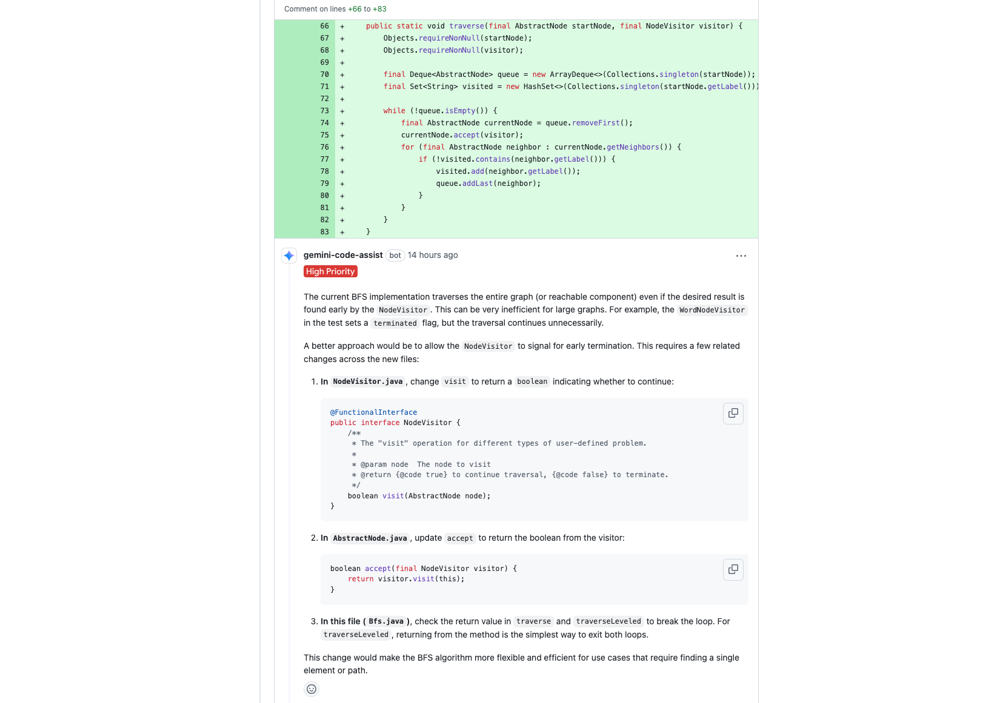

It was a regular AI review session in
[a pull request](https://github.com/QubitPi/gearbox/pull/23#discussion_r2260539188) on one of my projects. Little
background - I was implementing a general BFS (Breadth-First Search) algorithm which can be whipped as a JAR library into one of my developing Java webservices to solve various business problems. To boost its generality, I decided to implement it
using the [Visitor pattern](https://refactoring.guru/design-patterns/visitor) and the code below shows the simplified
version of my first draft sent to [gemini-code-assist](https://developers.google.com/gemini-code-assist/docs/review-github-code)
for review:

:::note

The irrelevant codes, such as Javadoc, `import`s, null-checks, etc., have been removed to reduce the distractions

:::

```java
public interface NodeVisitor {

    void visit(AbstractNode node);
}

public class Bfs {
    
    public static void traverse(final AbstractNode startNode, final NodeVisitor visitor) {
        final Deque<AbstractNode> queue = new ArrayDeque<>(Collections.singleton(startNode));
        final Set<String> visited = new HashSet<>(Collections.singleton(startNode.getLabel()));

        while (!queue.isEmpty()) {
            final AbstractNode currentNode = queue.removeFirst();
            currentNode.accept(visitor);
            for (final AbstractNode neighbor : currentNode.getNeighbors()) {
                if (!visited.contains(neighbor.getLabel())) {
                    visited.add(neighbor.getLabel());
                    queue.addLast(neighbor);
                }
            }
        }
    }
}
```




Basically, the AI is asking me to __break the strict Visitor pattern for a performance gain__. This almost immediately
triggered my opposition and I left my response as follows:


The Two Conflicting Personalities behind the Two Software Design
----------------------------------------------------------------

Different personality types can drive these software design debates. In the context of the BFS visitor pattern discussion, two conflicting personalities often emerge: the Architect and the Hacker.

What Different Past Personal Experiences Could Lead to Such a Diverted World-View like Architect v.s. Hacker?
-------------------------------------------------------------------------------------------------------------

### Technical

Different past personal experiences often shape the divergent worldviews of the "Architect" and "Hacker" in software
design. These experiences cultivate distinct priorities, risk tolerances, and problem-solving approaches.

:::important

Most people possess traits from both, and their experiences can lead to a more balanced approach over time.

:::

#### The Architect's Formative Experiences 🏛️

The "Architect" mindset is typically forged in environments where __stability__, __scalability__, __long-term
maintainability__, and risk mitigation are paramount.

- __Working on Large, Complex, and Long-Lived Systems__: Think enterprise software, financial systems, aerospace, or
  critical infrastructure. In these domains, a single bug can have catastrophic consequences (financial loss, safety
  hazards). Architects learn the hard way that quick fixes often lead to compounding
  [technical debt](https://neontri.com/blog/enterprise-software-development/#technical-debt) and instability over
  years.
- __Experiencing the Pain of Technical Debt__: They've likely inherited or worked on systems that were initially
  "hacked" together for speed. They've spent countless hours debugging, refactoring, and trying to extend brittle
  codebases, leading to a deep appreciation for upfront design and robust architecture.
- __Involvement in System Outages or Critical Bugs__: Being on call for major incidents caused by poor design, lack of
  testing, or insufficient planning teaches them the severe consequences of prioritizing speed over stability.
- __Formal Education and Mentorship__: Often, Architects have a strong academic background in computer science,
  emphasizing theoretical correctness, algorithms, data structures, and software engineering principles. They may also
  have been mentored by senior engineers who instilled a disciplined approach to design.
- __Working in Regulated Industries__: Industries with strict compliance requirements (e.g., healthcare, finance,
  government) necessitate meticulous design, extensive documentation, and rigorous testing, reinforcing a methodical and
  risk-averse approach.

These experiences instill a deep-seated value for __structure__, __predictability__, and __preventing future problems__,
even if it means a slower initial pace. They see the entire lifecycle of software and understand the compounding cost of
shortcuts.

#### The Hacker's Formative Experiences 💻

The "Hacker" mindset, in its positive sense, often develops in environments that prioritize __speed__, __rapid
iteration__, __immediate impact__, and __direct problem-solving__.

- __Startup or Fast-Paced Environments__: In startups, the primary goal is often to find product-market fit quickly,
  ship features rapidly, and iterate based on user feedback. Survival depends on speed, and "perfect" architecture can
  be seen as a luxury that delays crucial market entry.
- __Being a "Hero" Problem Solver__: They might have gained recognition for quickly fixing urgent production issues,
  implementing features under tight deadlines, or building prototypes that demonstrate immediate value. This reinforces
  the idea that direct action and quick results are highly valued.
- __Self-Taught or Project-Based Learning__: Many "Hackers" are highly skilled self-starters who learned by doing,
  experimenting, and building. Their knowledge is often gained through practical application and overcoming immediate
  technical hurdles, rather than through abstract theoretical study.
- __Projects with Short Lifespans or Disposable Prototypes__: If a project is meant to be a proof-of-concept or has a
  limited expected lifespan, the long-term architectural concerns become less relevant than getting it working quickly.
- __Focus on Direct Performance Gains__: They are often acutely aware of performance bottlenecks and driven to optimize
  code directly for speed, seeing any "unnecessary" abstraction or indirection as a barrier to efficiency.

These experiences cultivate a strong bias towards __action__, __efficiency__, and __delivering tangible results now__.
They are less concerned with hypothetical future problems and more focused on solving the current challenge in the most
direct way possible.

### Psychological

Certain early life experiences and inherent temperaments can also predispose individuals to lean towards an "Architect"
or "Hacker" worldview.

:::important

Early experiences often lay the groundwork for how individuals approach challenges, deal with uncertainty, and
prioritize different aspects of a solution. It is, therefore, important to remember that these are tendencies, not
deterministic paths. Many individuals develop a blend of these traits, and [professional experience](#technical) will
reinforce or modify these predispositions.

:::

#### For the "Architect" Mindset 🏛️

The Architect's preference for structure, planning, and long-term stability often stems from experiences that emphasize
__order__, __consequences__, and __thoroughness__.

There are positive forces that drives one into this direction. Children raised in environments with clear, consistently
enforced rules and predictable consequences may develop a strong internal sense of order and a belief in the importance
of adherence to established guidelines. They learn that following rules prevents negative outcomes and leads to
stability. If parents or caregivers encouraged planning, thinking ahead, and considering the long-term implications of
actions (e.g., "What happens if we don't save money now?"), this can foster a systematic, preventative mindset. Growing
up in a household where tasks were expected to be completed meticulously, with attention to detail and a focus on
durability (e.g., "Do it right the first time, so you don't have to do it again"), can instill a deep appreciation for
robust solutions.

Negative forces can come into play as well. This could be anything from a chaotic household where things frequently went
wrong due to lack of planning, to observing poorly organized projects in school or community activities. Experiencing
the negative consequences of disorder can create a strong desire to build robust, resilient systems. If they frequently
encountered systems or processes that were unreliable, broke easily, or were difficult to understand, it could foster a
drive to design for stability and clarity.

From a personality traits, potentially innate or early-developed, perspective, individuals naturally high in conscientiousness (a Big Five personality trait) tend to be organized, disciplined,
dutiful, and prefer planned behavior. This aligns well with the Architect's need for structure and foresight. A natural
aversion to risk or uncertainty might lead someone to prefer designs that minimize potential failure points and
prioritize predictability. A predisposition for breaking down problems into components, understanding interdependencies, and seeing the "big picture" from an early age (e.g., enjoying complex puzzles, building intricate models) can translate into architectural thinking.

#### For the "Hacker" Mindset 💻

The "Hacker's" drive for rapid iteration, immediate solutions, and direct impact often stems from experiences that reward
__adaptability__, __quick problem-solving__, and __tangible results__.

This mind set usually result from the early experiences in Resource-Constrained or Fast-Paced Environments. Growing up in situations where resources were scarce, and creative, immediate solutions were necessary to overcome challenges, can foster a "hack it together" mentality. They learn to be resourceful and prioritize getting something working over perfect execution. Hobbies like building with LEGOs or playing video games where immediate actions lead to immediate, visible results reinforce a preference for quick iterations, rapid feedback loops and tangible progress. A childhood spent tinkering, disassembling things to see how they work, and experimenting with solutions (even if they were "messy") can lead to a comfort with trial-and-error and a focus on functional outcomes.

Individuals high in openness tend to be curious, inventive, and prefer novelty. This can manifest as a desire to explore new solutions quickly and a willingness to deviate from established norms. A comfort with uncertainty and a willingness to take calculated risks (e.g., trying unconventional solutions, not needing a complete plan before starting) can drive a more experimental, pragmatic approach. A personality that prefers to jump in and start building rather than spending extensive time planning. They learn by doing and iterating. The intense satisfaction of quickly solving a problem or seeing a piece of code immediately work can be a powerful motivator, leading them to prioritize rapid implementation.
