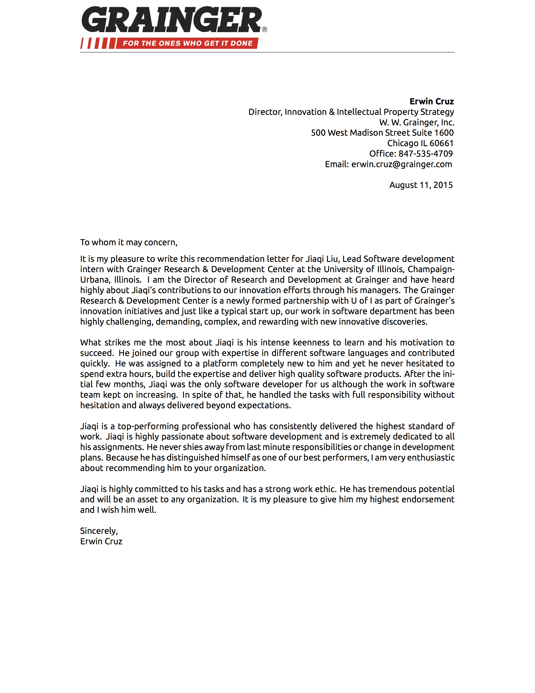
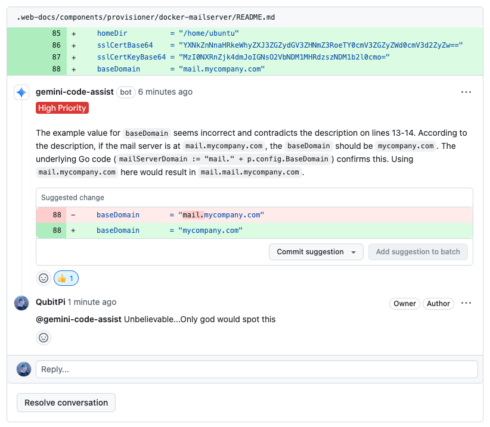

My name is Jiaqi Liu. I graduate from U of I, had internship at Fortune 500 Grainger Inc., worked at Yahoo for 4 years.

:::tip[Recommendation Letter from Grainger Inc.]

:::

Why I Believe in AI
===================

In my early career as a Software Engineer from 2016 to 2025, I had experienced what it called "Stackoverflow-oriented"
or "Google-oriented" programming. Whenever I need to deal with a bug or check something technical real quick, I google
that thing and pick up the top stackoverflow result. That basically was my toolbox all the time.

Beginning in 2024, however, I noticed everytime when I ask Google something, it almost always stick an "AI-generated"
answer up to the top of the search results. Having been almost anti-AI, I always ignored that in the beginning, but the
increasingly high-quality AI-generated technical answers, whether it's a piece of clean code snippet or a nuanced
solution for fixing a bug, slowly neutralized my former view. I started to use its answer occasionally later often, and
ultimately almost only. This gradual adaption of AI into my career hit its radical influence of my life in late July
2025 when I discovered that Google Gemini could perform automatic code review on GitHub pull request and I can still
remember how
[I was amazed by its sheer accuracy at a level that almost no human can ever compare](https://github.com/QubitPi/packer-plugin-qubitpi/pull/64):

This is the moment when AI hit my pain-point - longing for
[good code reviews](https://ai.qubitpi.org/posts/software-is-about-making-it-right/) for my Software Engineering work.
Having truly benefited from it, I fully embraced AI, started learning all aspects of it, and eventually became an AI
advocate.

I believe AI fits in one side of the two prevailing views of this world:

1. [__Determinism__](https://ai.qubitpi.org/posts/determinism/): Given an initial condition, the future has all been
   _pre-determined_. No one can alter the course of the universe and the destinies of human beings. This is the doctrine
   philosophy behind Newtonian Mechanics, [General Relativity](https://relativity.qubitpi.org/), computer systems, and
   AI.
2. __Libertarianism__: We believe in _free-will_ and we are free to choose. The future is in our hands not because we
   are programmed to but because we choose to. This is the guiding principle of evolving human, the futurists, and the
   revolutionist of Quantum Mechanics.

:::tip[Throughout history, tremendous efforts have been put to reconcile them]

- __Ordinary Lives__: people harness logic and emotion inside a single soul
- __Philosophy__: the development of [Compatibilism](https://youtu.be/KETTtiprINU) that seeks the common ground between Determinism and
  Libertarianism
- __Science__: the attempt to [unify General Relativity and Quantum Mechanics](https://en.wikipedia.org/wiki/Unified_field_theory) since Albert Einstein
- __Public Media__: the discussions around the fight between radical determinism of Skynet and the brave libertarianism
  hold by human resistance depicted in [movie _Terminator_ series](https://en.wikipedia.org/wiki/Terminator_(franchise)) and the like

  

:::

__The dynamics of these two conflicting views and, thus, the uncertainties of co-existing of human and machine in the
future world are the reasons why I believe tomorrow is so exciting and a challenging but promising future is yet to
come__.

[ai.qubitpi.org](https://ai.qubitpi.org/) serves as my life-long effort to learn, practice, and build AI into human's
future.

::github{repo="QubitPi/ai-blogs"}
